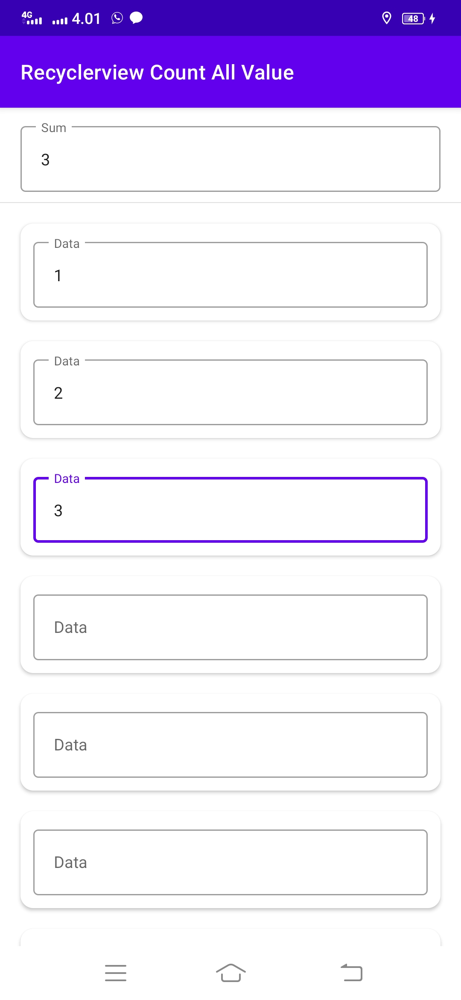

# RecyclerviewCountAllValue

// https://github.com/gzeinnumer/RecyclerviewCountAllValue/blob/master/

<pre>

</pre>

#### [MainActivity.java](app/src/main/java/com/gzeinnumer/recyclerviewcountallvalue/MainActivity.java)
```java
public class MainActivity extends AppCompatActivity {
    private ActivityMainBinding binding;

    @Override
    protected void onCreate(Bundle savedInstanceState) {
        super.onCreate(savedInstanceState);
        binding = ActivityMainBinding.inflate(getLayoutInflater());
        setContentView(binding.getRoot());

        initView();
    }

    private CountDataAdapter adapter;

    private void initView() {
        ArrayList<String> list = new ArrayList<>();
        for (int i = 0; i < 10; i++) {
            list.add("");
        }
        adapter = new CountDataAdapter(getApplicationContext(), list);

        binding.rv.setAdapter(adapter);
        binding.rv.setLayoutManager(new LinearLayoutManager(getApplicationContext()));
        binding.rv.hasFixedSize();

        adapter.setOnFocusListener(isFocus -> {
            if (isFocus) countNow();
        });
    }

    private void countNow() {
        int[] countAll = new int[adapter.getHolders().size()];
        for (int i = 0; i < adapter.getHolders().size(); i++) {
            ItemRvBinding bind = adapter.getHolders().get(i);
            if (bind!=null){
                String s = bind.edData.getText().toString();
                if (s.length() > 0) {
                    countAll[i] = Integer.parseInt(s);
                } else {
                    countAll[i] = 0;
                }
            }
        }

        int sum = 0;
        for (int value : countAll) sum += value;

        binding.edSum.setText(String.valueOf(sum));
    }
}
```
#### [CountDataAdapter.java](app/src/main/java/com/gzeinnumer/recyclerviewcountallvalue/CountDataAdapter.java)
```java
public class CountDataAdapter extends RecyclerView.Adapter<CountDataAdapter.MyHolder> implements Filterable {
    private final List<ItemRvBinding> holders;

    public CountDataAdapter(Context context, List<String> list) {
        this.holders = new ArrayList<>(list.size());
        initHolders();
    }
    
    public void setOnFocusListener(OnFocusListener onFocusListener) {
        this.onFocusListener = onFocusListener;
    }

    public void setList(List<String> list) {
        initHolders();
    }

    private void initHolders() {
        for (int i = 0; i < list.size(); i++) {
            holders.add(null);
        }
    }

    public List<ItemRvBinding> getHolders() {
        return holders;
    }
    
    ...
}
```

#### [item_rv.xml](app/src/main/res/layout/item_rv.xml)

#### [activity_main.xml](app/src/main/res/layout/activity_main.xml)

---

```
Copyright 2021 M. Fadli Zein
```
